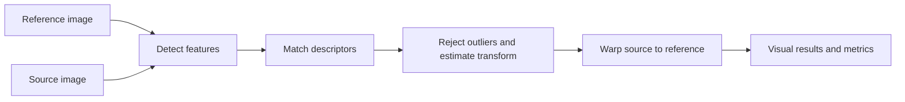

<div align="center">

# 🌕 Lunar Image Registration

### A computer-vision prototype for aligning lunar surface images

[](https://www.python.org/)
[](https://opencv.org/)
[](https://streamlit.io/)
[](#prototype-scope)

**Smart India Hackathon problem statement:** “Multi-modal, Sun angle and scale invariant image correspondence using Chandrayaan-2 optical images.”

</div>

---

## ✨ What it does

Give the app a **reference image** and a **source image**. It detects visual features, matches them, estimates a geometric transform, then warps the source onto the reference image’s pixel grid. The interface shows visual comparisons and alignment metrics so you can inspect the result.

This repository is an exploratory classical computer-vision baseline for the SIH problem statement. It is not a finished or validated solution, and its current NASA sample pair is from Lunar Reconnaissance Orbiter data—not Chandrayaan-2.

## 🧭 How it works



The pipeline supports **SIFT, ORB, and AKAZE** feature detectors; **FLANN or BFMatcher** descriptor matching; and **homography or partial affine** transforms. Optional CLAHE enhancement and Gaussian blur are available before feature detection. Homography estimation uses USAC_MAGSAC when supported by the installed OpenCV, with RANSAC fallback; affine estimation uses RANSAC.

## 🖼️ Inspect the results

The Streamlit app can display:

- Feature matches, with inliers highlighted
- The registered (warped) source image
- A difference heatmap, alpha blend, and red-cyan overlay
- Match and inlier counts, inlier ratio, reprojection RMSE, transform, and runtime

## 🚀 Quick start

Python 3.10 or newer is recommended.

```bash
git clone https://github.com/Vishalchandravanshiai/-LUNAR-IMAGE-Registration.git
cd -LUNAR-IMAGE-Registration
python -m venv .venv
```

Activate the environment, then install dependencies and launch the app:

```bash
# Windows PowerShell
.venv\Scripts\Activate.ps1

# macOS / Linux
# source .venv/bin/activate

python -m pip install -r requirements.txt
streamlit run ui/streamlit_app.py
```

Open the local address printed by Streamlit (usually `http://localhost:8501`). You can also launch with `python app/main.py --ui`.

## 🌑 Try the built-in test pair

In the app sidebar, select **Fetch NASA Multi-Angle Test Pair**. The app downloads a public LROC stereo anaglyph and separates its two viewing-angle channels into a test pair. The two images cover the same lunar area from different angles; this is useful for trying registration on parallax and terrain differences.

The image is fetched when requested and is not included in this repository. Source: [LROC NAC anaglyph product M1181613435_M1181606332](https://data.lroc.im-ldi.com/lroc/view_rdr/NAC_ANAGLYPH_M1181613435_M1181606332).

You can also upload your own images in PNG, JPEG, or TIFF format.

## ⌨️ Command line

For a direct registration run without the UI:

```bash
python app/main.py --ref path/to/reference.png --src path/to/source.png --out outputs/
```

Run `python app/main.py --help` to see the available detector, matcher, transform, ratio, and RANSAC threshold options.

## 🗂️ Project structure

```text
app/          Registration pipeline and command-line entry point
ui/           Streamlit interface
scripts/      Utility scripts
tests/        Synthetic fixtures and unit tests
```

## 🧪 Tests

Run the unit tests from the repository root:

```bash
python -m unittest discover -s tests
```

## 🎯 Prototype scope

The implementation demonstrates image-to-image feature matching and geometric alignment. It has **not** been validated against Chandrayaan-2 OHRC, TMC-2, or IIRS imagery, and it does not currently establish geospatial or map-coordinate accuracy. Classical local features can also struggle with large illumination changes, low-texture regions, strong terrain relief, or substantial differences in viewing conditions. Treat the output as an image-registration experiment and inspect the overlays and inlier metrics before drawing conclusions.

## 📌 Next steps

- Evaluate on suitable Chandrayaan-2 image pairs
- Measure alignment accuracy against trusted control points
- Explore methods designed for cross-sensor, illumination, and terrain variation
- Add geospatial metadata handling if required by the use case

---

<div align="center">

Built as a prototype for the **Smart India Hackathon** lunar image registration problem statement.

</div>
