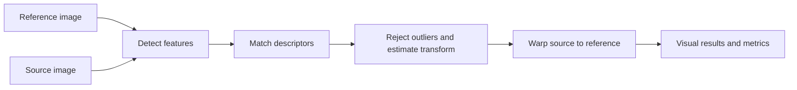

<div align="center">

# 🌕 Lunar Image Registration
</div>

> [!IMPORTANT]
> **🚀 LIVE DEMO — [Open the Lunar Image Registration prototype →](https://huggingface.co/spaces/vishalchandravanshii/lunar-image-registration)**

<div align="center">

### A computer-vision prototype for aligning lunar surface images

[](https://www.python.org/)
[](https://opencv.org/)
[](https://www.gradio.app/)
[](#prototype-scope)

**Smart India Hackathon problem statement:** “Multi-modal, Sun angle and scale invariant image correspondence using Chandrayaan-2 optical images.”

</div>

---

## ✨ What it does

Upload a **reference image** and a **source image**. The app detects visual features, matches them, estimates a geometric transform, then warps the source onto the reference image’s pixel grid. Inspect feature matches, registration overlays, and alignment metrics in the Gradio interface.

This repository is an exploratory classical computer-vision baseline for the SIH problem statement. It is not a finished or validated solution, and the optional NASA sample pair is from Lunar Reconnaissance Orbiter data—not Chandrayaan-2. The hosted interface runs on Hugging Face ZeroGPU, while image registration itself runs on CPU.

## 🧭 How it works



The pipeline supports **SIFT, ORB, and AKAZE** feature detectors; **FLANN or BFMatcher** descriptor matching; and **homography or partial affine** transforms. Optional CLAHE enhancement and Gaussian blur are available before feature detection. Homography estimation uses USAC_MAGSAC when supported by OpenCV, with RANSAC fallback; affine estimation uses RANSAC.

## 🖼️ Results in the app

- Feature correspondences and geometrically verified inliers
- The registered (warped) source image and a difference heatmap
- Red-cyan anaglyph and adjustable alpha blend
- Match and inlier counts, inlier ratio, reprojection RMSE, transform, and runtime

## 🚀 Run locally

Python 3.10 or newer is recommended.

```bash
git clone https://github.com/Vishalchandravanshiai/-LUNAR-IMAGE-Registration.git
cd -LUNAR-IMAGE-Registration
python -m venv .venv
```

Activate the environment, then install dependencies and launch the Gradio app:

```bash
# Windows PowerShell
.venv\Scripts\Activate.ps1

# macOS / Linux
# source .venv/bin/activate

python -m pip install -r requirements.txt
python app.py
```

Open the local URL printed in the terminal (usually `http://127.0.0.1:7860`). You can also launch the UI with `python app/main.py --ui`.

## 🌑 Try the built-in test pair

Click **Fetch NASA Multi-Angle Test Pair** in the app. It retrieves a public LROC stereo anaglyph and separates the two viewing-angle channels into a test pair. Both images cover the same lunar area from different angles, useful for exploring registration with parallax and terrain differences.

The image is fetched only when requested and is not stored in the repository. Source: [LROC NAC anaglyph product M1181613435_M1181606332](https://data.lroc.im-ldi.com/lroc/view_rdr/NAC_ANAGLYPH_M1181613435_M1181606332).

You can also upload your own PNG, JPEG, or TIFF images.

## ⌨️ Command line

Run the registration pipeline without opening the UI:

```bash
python app/main.py --ref path/to/reference.png --src path/to/source.png --out outputs/
```

Run `python app/main.py --help` to see the available detector, matcher, transform, ratio, and RANSAC threshold options.

## 🗂️ Project structure

```text
app.py        Hugging Face Spaces entry point
app/          Registration pipeline command-line entry point
core/         Feature detection, matching, and image registration
ui/           Gradio interface
scripts/      Utility scripts
tests/        Synthetic fixtures and unit tests
```

## 🧪 Tests

Run the unit tests from the repository root:

```bash
python -m unittest discover -s tests
```

## 🎯 Prototype scope

The implementation demonstrates image-to-image feature matching and geometric alignment. It has **not** been validated against Chandrayaan-2 OHRC, TMC-2, or IIRS imagery, and it does not currently establish geospatial or map-coordinate accuracy. Classical local features can struggle with large illumination changes, low-texture regions, strong terrain relief, or substantial differences in viewing conditions. Treat the output as an image-registration experiment and inspect the overlays and inlier metrics before drawing conclusions.

## 📌 Next steps

- Evaluate on suitable Chandrayaan-2 image pairs
- Measure alignment accuracy against trusted control points
- Explore methods designed for cross-sensor, illumination, and terrain variation
- Add geospatial metadata handling if required by the use case

---

<div align="center">

Built as a prototype for the **Smart India Hackathon** lunar image registration problem statement.

</div>